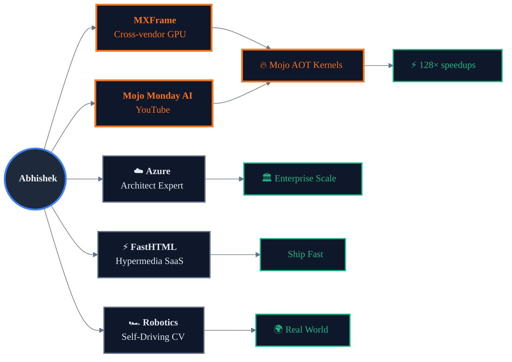

# 👋 Abhishek Sreesaila

### 🚀 Building cross-vendor GPU compute · 🎥 Teaching Mojo · ☁️ Azure Solutions Architect Expert

*Where Python ergonomics meet bare-metal performance.*

---

> ### 💭 *"High performance is the standard. Cloud scale is the requirement."*

---

## 🚀 Featured: MXFrame — GPU DataFrames Without CUDA Lock-In

> **A DataFrame query engine with Polars-style ergonomics and Mojo AOT kernels — runs on NVIDIA, AMD, and Apple Silicon. No CUDA. No JIT tax.**

### 🔥 What makes it different

|  | pandas | Polars | cuDF | **🚀 MXFrame** |
| :--- | :---: | :---: | :---: | :---: |
| 🎮 GPU support | ❌ | ❌ | NVIDIA only | ✅ **Any GPU** |
| ⚙️ Compiled kernels | ❌ | Rust | CUDA | ✅ **Mojo AOT** |
| 📦 Install | pip | pip | CUDA stack | `pixi install` |
| 🌐 Cross-vendor | ❌ | ❌ | ❌ | ✅ NVIDIA / AMD / Apple |

### 📊 TPC-H Headline Wins (10M rows, vs Polars)

<table>
<tr>
<td align="center" width="20%">

### 🥇 **128×**
**Q9** — Product Profit
*(6-table join)*

</td>
<td align="center" width="20%">

### 🥈 **89×**
**Q12** — Join + Agg

</td>
<td align="center" width="20%">

### 🥉 **42×**
**Q7** — Shipping Volume

</td>
<td align="center" width="20%">

### ⚡ **32×**
**Q8** — Market Share

</td>
<td align="center" width="20%">

### 🎯 **22×**
**Q5** — Multi-join

</td>
</tr>
</table>

> 🏆 MXFrame CPU beats Polars on **18/22** TPC-H queries · GPU wins on **15/22** · Reproducible benchmark on RTX 3090 + AMD 12-core

### ➡️ **[Explore mxframe →](https://github.com/abhisheksreesaila/mxframe)**

---

## 🎥 Mojo Monday AI — *Mastering the Future of AI*

<table>
<tr>
<td width="40%" align="center" valign="middle">

### ▶️ **[youtube.com/@mojomondayai](https://www.youtube.com/@mojomondayai)**

</td>
<td width="60%" valign="middle">

A weekly deep-dive into the language and runtime powering the next wave of AI compute. **Mojo, MAX, GPU kernels, and the engineering that makes performance look easy.**

🔥 New episode every **Monday**
🧠 From first principles → production patterns
⚡ The same Mojo that powers MXFrame, demystified

</td>
</tr>
</table>

---

## 🛠️ The Rest of the Stack

<table>
<tr>
<td width="50%" valign="top">

### 🔥 Mojo GPU Tutorials
**[mojo-gpu-tutorials →](https://github.com/abhisheksreesaila/mojo-gpu-tutorials)**

The code companion to the YouTube channel. Hands-on Mojo & Modular MAX walkthroughs.

</td>
<td width="50%" valign="top">

### ☁️ Azure Architecture
**Solutions Architect Expert (Certified)**

Enterprise-scale infrastructure design. Identity, networking, governance — the load-bearing stuff.

</td>
</tr>
<tr>
<td width="50%" valign="top">

### ⚡ FastHTML Ecosystem
**[fh-saas →](https://github.com/abhisheksreesaila/fh-saas)** · **[fh-matui →](https://github.com/abhisheksreesaila/fh-matui)**

Production SaaS patterns and Material UI components. Hypermedia-first, no build step.

</td>
<td width="50%" valign="top">

### 🏎️ Self-Driving Cars
**[Self-Driving Car Engineer →](https://github.com/abhisheksreesaila/Udacity-Self-Driving-Car-Engineer)**

Computer vision, sensor fusion, path planning. Where the cloud meets the road.

</td>
</tr>
</table>

---

## 🧠 How it all connects

```mermaid
%%{init: {'theme':'base', 'themeVariables': {'primaryColor':'#0f172a','primaryTextColor':'#f1f5f9','primaryBorderColor':'#3b82f6','lineColor':'#64748b','fontFamily':'ui-sans-serif'}}}%%
graph LR
    Me(("`👋 **Abhishek**`"))

    Me --> MX["`🚀 **MXFrame**
    Cross-vendor GPU`"]
    Me --> YT["`🎥 **Mojo Monday AI**
    YouTube`"]
    Me --> Cloud["`☁️ **Azure**
    Architect Expert`"]
    Me --> Web["`⚡ **FastHTML**
    Hypermedia SaaS`"]
    Me --> Robo["`🏎️ **Robotics**
    Self-Driving CV`"]

    MX --> Mojo["`🔥 Mojo AOT Kernels`"]
    YT --> Mojo
    Mojo --> Perf["`⚡ 128× speedups`"]
    Cloud --> Scale["`🏛️ Enterprise Scale`"]
    Web --> Ship["`🚢 Ship Fast`"]
    Robo --> Real["`🌍 Real World`"]

    classDef hub fill:#1e293b,stroke:#3b82f6,stroke-width:3px,color:#f1f5f9
    classDef hero fill:#0f172a,stroke:#f97316,stroke-width:3px,color:#f97316
    classDef pillar fill:#0f172a,stroke:#64748b,stroke-width:2px,color:#e2e8f0
    classDef outcome fill:#0f172a,stroke:#10b981,stroke-width:2px,color:#10b981
    class Me hub
    class MX,YT,Mojo hero
    class Cloud,Web,Robo pillar
    class Scale,Ship,Real,Perf outcome
```

---

### 🤝 Let's connect

⭐ If mxframe is useful, a star helps it find the people who need it. ▶️ If Mojo Monday teaches you something, hit subscribe.

