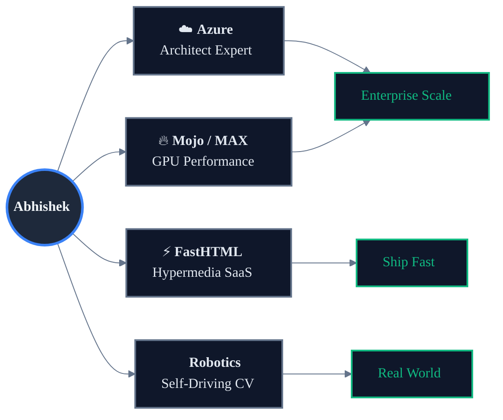

# Abhishek Sreesaila

### `Azure Solutions Architect Expert` · `AI Performance` · `FastHTML`

*Building at the intersection of cloud scale, GPU-accelerated AI, and autonomous systems.*

---

> *"High performance is the standard. Cloud scale is the requirement."*

---

## What I'm building

<table>
<tr>
<td width="50%" valign="top">

### 🔥 GPU-Accelerated AI
**[mojo-gpu-tutorials →](https://github.com/abhisheksreesaila/mojo-gpu-tutorials)**

Hands-on tutorials for Mojo and Modular MAX. Bringing Python ergonomics to bare-metal GPU performance — the future of AI compute.

</td>
<td width="50%" valign="top">

### ☁️ Cloud Architecture
**Azure Solutions Architect Expert**

Designing scalable enterprise infrastructure on Microsoft Azure. Identity, networking, governance, and cost — the boring stuff that makes everything else possible.

</td>
</tr>
<tr>
<td width="50%" valign="top">

### ⚡ FastHTML Ecosystem
**[fh-saas →](https://github.com/abhisheksreesaila/fh-saas)** · **[fh-matui →](https://github.com/abhisheksreesaila/fh-matui)**

Production SaaS patterns and Material UI components for FastHTML. Server-rendered, hypermedia-first, no build step.

</td>
<td width="50%" valign="top">

### 🏎️ Autonomous Systems
**[Self-Driving Car Engineer →](https://github.com/abhisheksreesaila/Udacity-Self-Driving-Car-Engineer)**

Computer vision, sensor fusion, and path planning. Where the cloud meets the road.

</td>
</tr>
</table>

---

## How it all connects

```mermaid
%%{init: {'theme':'base', 'themeVariables': {'primaryColor':'#0f172a','primaryTextColor':'#f1f5f9','primaryBorderColor':'#3b82f6','lineColor':'#64748b','fontFamily':'ui-sans-serif'}}}%%
graph LR
    Me(("`**Abhishek**`"))

    Me --> Cloud["`☁️ **Azure**
    Architect Expert`"]
    Me --> AI["`🔥 **Mojo / MAX**
    GPU Performance`"]
    Me --> Web["`⚡ **FastHTML**
    Hypermedia SaaS`"]
    Me --> Robo["`🤖 **Robotics**
    Self-Driving CV`"]

    Cloud --> Scale["`Enterprise Scale`"]
    AI --> Scale
    Web --> Ship["`Ship Fast`"]
    Robo --> Real["`Real World`"]

    classDef hub fill:#1e293b,stroke:#3b82f6,stroke-width:3px,color:#f1f5f9
    classDef pillar fill:#0f172a,stroke:#64748b,stroke-width:2px,color:#e2e8f0
    classDef outcome fill:#0f172a,stroke:#10b981,stroke-width:2px,color:#10b981
    class Me hub
    class Cloud,AI,Web,Robo pillar
    class Scale,Ship,Real outcome
```

---

### Find me

⭐ If something here is useful, a star goes a long way.

