# 🏛️ Abhishek Sreesaila | Microsoft Azure Expert & AI Advocate

  <b><i>"High Performance is the Standard. Cloud Scale is the Requirement."</i></b>

---

### 🗺️ My Tech Mind Map
*A uniform, neutral overview of my current ecosystem focus.*

```mermaid
graph TD
    %% Uniform Blueprint Styling
    classDef blueprint fill:#ffffff,stroke:#475569,stroke-width:2px,color:#1e293b,rx:12,ry:12;

    User((<b>Abhishek Sreesaila</b>)):::blueprint
    
    %% Main Pillars with Emojis
    AI[Modular MAX & Mojo 🔥]:::blueprint
    Cloud[Microsoft Azure Cloud ☁️]:::blueprint
    Web[FastHTML Ecosystem ⚡]:::blueprint
    Robo[Autonomous Systems 🤖]:::blueprint

    %% Connections
    User --- AI
    User --- Cloud
    User --- Web
    User --- Robo

    %% Project Details
    AI --- Mojo[Mojo GPU Tutorials 🚀]:::blueprint
    Cloud --- Cert[Expert Cloud Architect 🏛️]:::blueprint
    Web --- fh1[fh-saas 📦]:::blueprint
    Web --- fh2[fh-matui 🎨]:::blueprint
    Robo --- SDC[Self-Driving Car Eng 🏎️]:::blueprint

    %% Link Styling
    linkStyle default stroke:#94a3b8,stroke-width:2px;

```

---
### 🛠️ Active Ecosystems

| Ecosystem | Focus & Expertise | Primary Repository |
| --- | --- | --- |
| ☁️ **Microsoft Azure** | **Certified Solutions Architect Expert**; Scalable Enterprise Infrastructure. | *(Cloud Architecture)* |
| 🔥 **MAX & Mojo** | **AI Performance Advocate**; Next-Gen GPU-accelerated compute. | **[mojo-gpu-tutorials](https://github.com/abhisheksreesaila/mojo-gpu-tutorials)** |
| ⚡ **FastHTML** | **Ecosystem Developer**; Building SaaS patterns & UI components. | **[fh-saas](https://github.com/abhisheksreesaila/fh-saas)** / **[fh-matui](https://github.com/abhisheksreesaila/fh-matui)** |
| 🤖 **Robotics** | **Autonomous Systems**; CV & Self-Driving Car engineering. | **[Self-Driving-Car-Eng](https://github.com/abhisheksreesaila/Udacity-Self-Driving-Car-Engineer)** |

---

